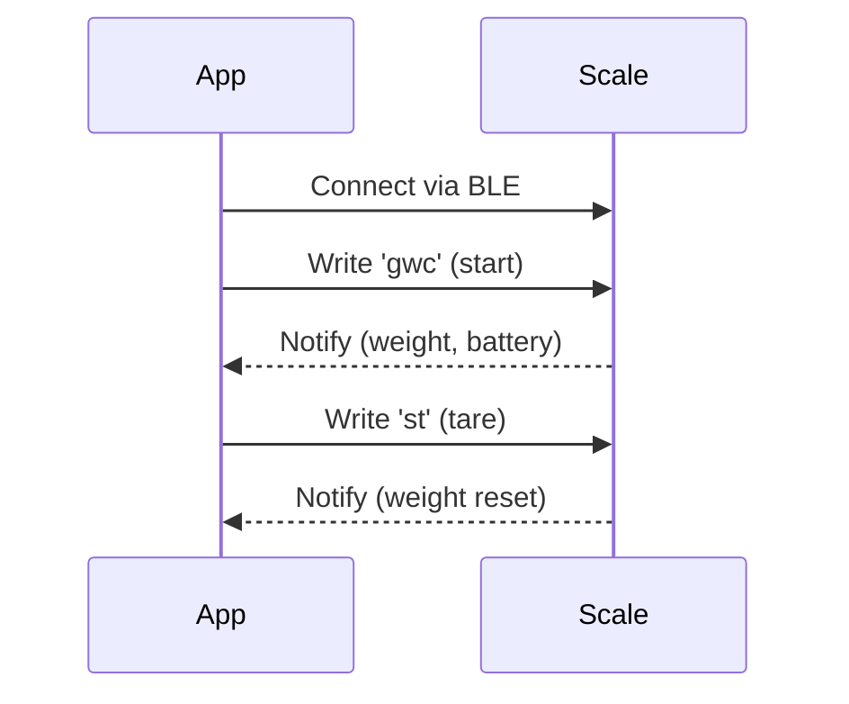

# Simple Prozis Bit Scale
<p align="center">
  
  
</p>

A React Native app to connect, read, and interact with the Prozis Bit Scale via Bluetooth Low Energy (BLE). This project demonstrates the reverse engineering of the scale's BLE protocol, providing weight, battery readings and tare functionality.

## Features

- **Bluetooth LE Scanning & Connection**: Automatically scans for and connects to the "PROZIS Bit Scale".
- **Sticky Reconnect**: Automatically reconnects when the scale turns back on.
- **Real time Weight Display**: Shows real time weight readings from the scale.
- **Battery Level Monitoring**: Displays the scale's battery percentage.
- **Low Battery Warning**: Shows a warning overlay when the scale battery is low.
- **Tare Functionality**: Remotely tares the scale from the app.
- **Save & Tare**: Save the current weight and immediately tare in one action.
- **Auto-Save (Stability Hold)**: Optional hands-free auto-save when the weight stays stable for ~2 seconds.
- **Copy Session to Clipboard**: Copy the full session as formatted text for pasting into other apps.
- **Disconnect / Reconnect**: Manually disconnect and reconnect to the scale.
- **Removed Weights**: Negative weights are treated as removals and are displayed/exported as `X g (removed)`.

## Reverse Engineering: Prozis Bit Scale BLE Protocol

### BLE Service & Characteristics

The Prozis Bit Scale uses a Nordic UART-like protocol over BLE. The UUIDs for the service and characteristics are as follows:

- **Service UUID**: `6e400001-b5a3-f393-e0a9-e50e24dcca9e`
- **RX Characteristic (Write)**: `6e400002-b5a3-f393-e0a9-e50e24dcca9e`
- **TX Characteristic (Notify)**: `6e400003-b5a3-f393-e0a9-e50e24dcca9e`

### Commands

The app communicates with the scale using specific commands sent to the RX characteristic. The scale responds with notifications on the TX characteristic.

- **Start Data Stream**: Send `gwc` to RX characteristic to begin receiving weight data.
- **Tare**: Send `st` to RX characteristic to tare the scale.

### Data Decoding

- **Battery Level**: Extracted from the second byte (hex), value 0–100.
- **Weight**: Extracted from the last 2 bytes (hex), signed 16-bit integer, in grams.



## Getting Started

### Prerequisites

- Node.js and npm installed
- For Android: Android Studio with SDK
- For iOS: macOS with Xcode 15.0+ (see [iOS_BUILD.md](iOS_BUILD.md))

### Installation

1. Install dependencies:

   ```bash
   npm install
   ```

2. For iOS, generate native code:
   ```bash
   npx expo prebuild --platform ios
   cd ios && pod install
   ```

### Running the App

**Development Mode:**

```bash
npx expo start
```

**On Android:**

```bash
npx expo run:android
```

**On iOS:**
See [iOS_BUILD.md](iOS_BUILD.md) for detailed Xcode build instructions.

## Platform Support

- ✅ **Android**: Fully supported (API 23+)
- ✅ **iOS**: Supported (iOS 15.1+) - See [iOS_BUILD.md](iOS_BUILD.md) for setup

### iOS-Specific Features

- **Background BLE:** Disabled (foreground only)
- **Screen Wake Lock:** Enabled to prevent sleep during measurements
- **Privacy Manifest:** Included for App Store compliance
- **Bluetooth Permission:** Properly configured via app.json

## Notes

- Only works with the Prozis Bit Scale (BLE name: `PROZIS Bit Scale`)
- BLE requires physical device (does not work on iOS Simulator or Android Emulator)
- Ensure Bluetooth and location permissions are granted
