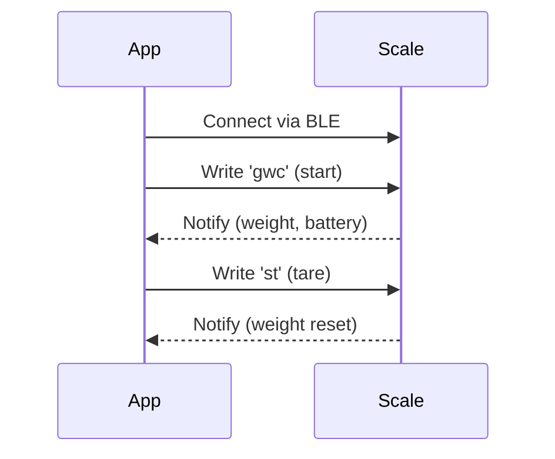

# Simple Prozis Bit Scale

A React Native app to connect, read, and interact with the Prozis Bit Scale via Bluetooth Low Energy (BLE). This project demonstrates the reverse engineering of the scale's BLE protocol, providing weight, battery readings and tare functionality.

## Features

- **Bluetooth LE Scanning & Connection**: Automatically scans for and connects to the "PROZIS Bit Scale".
- **Real time Weight Display**: Shows real time weight readings from the scale.
- **Battery Level Monitoring**: Displays the scale's battery percentage.
- **Tare Functionality**: Remotely tares the scale from the app.
- **Save & Manage Weights**: Save, view, and delete multiple weight measurements.

## Reverse Engineering: Prozis Bit Scale BLE Protocol

### BLE Service & Characteristics

The Prozis Bit Scale uses a Nordic UART-like protocol over BLE. The UUIDs for the service and characteristics are as follows:

- **Service UUID**: `6e400001-b5a3-f393-e0a9-e50e24dcca9e`
- **RX Characteristic (Write)**: `6e400002-b5a3-f393-e0a9-e50e24dcca9e`
- **TX Characteristic (Notify)**: `6e400003-b5a3-f393-e0a9-e50e24dcca9e`

### Commands

The app communicates with the scale using specific commands sent to the RX characteristic. The scale responds with notifications on the TX characteristic.

- **Start Data Stream**: Send `gwc` to RX characteristic to begin receiving weight data.
- **Tare**: Send `st` to RX characteristic to tare the scale.

### Data Decoding

- **Battery Level**: Extracted from the second byte (hex), value 0–100.
- **Weight**: Extracted from the last 2 bytes (hex), signed 16-bit integer, in grams.

## Getting Started

1. Install dependencies:  
   `npm install`
2. Run on your device:  
   `npx expo start`
3. Ensure Bluetooth and location permissions are granted.

## Notes

- Only works with the Prozis Bit Scale (BLE name: `PROZIS Bit Scale`).
- Tested only on Android; iOS support may require additional configuration.
